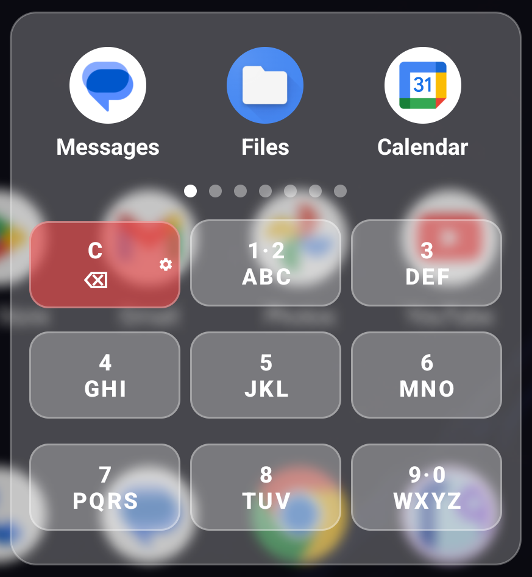
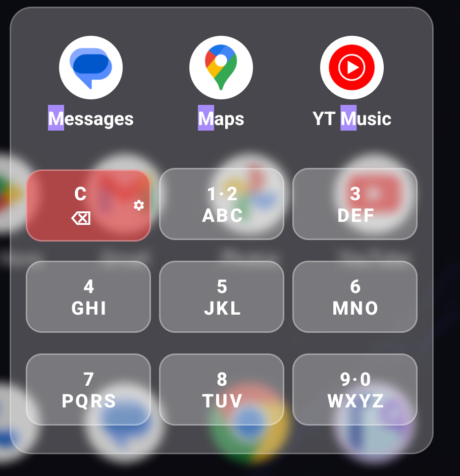
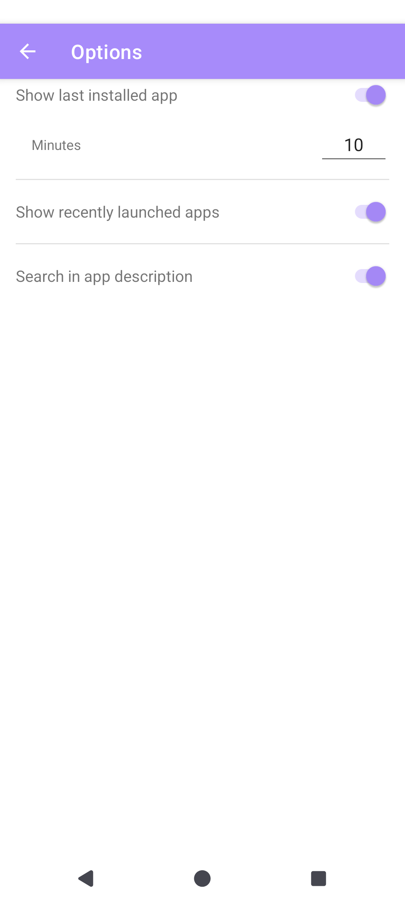

# T9 Launcher

-brightgreen)


A fast, keyboard-driven app launcher for Android that uses T9-style input to search and launch your apps in seconds.

## Overview

T9 Launcher appears as a translucent overlay card triggered by a home screen shortcut. Instead of scrolling through app drawers or typing on a full keyboard, you search using the numeric keypad — just like T9 predictive text. Each number key maps to a set of letters, and the launcher filters your installed apps in real time as you press digits.

The card positions itself near where you tapped, keeps your wallpaper visible through a blurred background, and dismisses as soon as you launch an app.

**Supported languages:** English, Italian
**Requires:** Android 13 (API 33) or higher

## How It Works

### Launching the overlay

Add a T9 Launcher shortcut to your home screen. Tapping it opens the overlay card anchored near your tap position.

### Searching with T9

The card displays a 3×3 numeric keyboard (keys 2–9) with standard T9 letter mappings:

| Key | Letters |
|-----|---------|
| 2   | A B C   |
| 3   | D E F   |
| 4   | G H I   |
| 5   | J K L   |
| 6   | M N O   |
| 7   | P Q R S |
| 8   | T U V   |
| 9   | W X Y Z |

As you press digits, the app list filters to show only matching apps. The match works on the **first letter of each word** in an app name: for example, pressing `9 2` would match "WhatsApp" (W→9, A→2).

Matched characters are highlighted in the app name (yellow background, bold text).

### Browsing results

Matching apps are displayed as icon + name cards, three per page. Swipe left/right to browse pages. Tap an app to launch it.

**Sorting:** Apps are ordered by launch frequency over the last 10 days, then alphabetically.

### Keyboard controls

- **Clear button:** removes the last digit
- **Long-press Clear:** opens Settings

### Long-press on an app

Opens a context menu with:
- **App Info** — opens Android's app info screen
- **Uninstall** — initiates app uninstallation

### Settings

Accessible via long-press on the Clear button. Options include:

- Show the most recently installed app at the top of the list
- Show recently launched apps first when no digits are entered
- Search in app descriptions (in addition to app names)

## Screenshots

| Idle | Search active | Settings |
|------|--------------|----------|
|  |  |  |

## Development

### Prerequisites

- [Android Studio](https://developer.android.com/studio) (latest stable recommended)
- Android SDK 33 or higher
- JDK 11+

### Build

```bash
# Build debug APK
./gradlew assembleDebug

# Build release APK (requires signing config)
./gradlew assembleRelease
```

### Run tests

```bash
# Unit tests
./gradlew test

# Instrumented tests (requires connected device or emulator)
./gradlew connectedAndroidTest
```

### Install on a connected device

```bash
./gradlew installDebug
```

### Project structure

```
app/src/main/java/fasolato/click/t9launcher/
├── MainActivity.kt         # Overlay UI, T9 input, app loading and filtering
├── AppPageAdapter.kt       # ViewPager2 adapter (3 apps per page, match highlighting)
├── LaunchTracker.kt        # Persists launch history (10-day window, SharedPreferences)
├── OptionsActivity.kt      # Settings screen
├── OptionsRepository.kt    # User preferences management
└── SkeletonAdapter.kt      # Placeholder shown while app list loads
```

## Installation (Sideloading)

T9 Launcher is not currently available on the Play Store. You can install it by building locally and sideloading.

### Step 1 — Build the APK

```bash
./gradlew assembleDebug
```

The output APK will be at:
```
app/build/outputs/apk/debug/app-debug.apk
```

### Step 2 — Install on your device

**Option A: via ADB**

Connect your device via USB with USB debugging enabled, then run:

```bash
adb install app/build/outputs/apk/debug/app-debug.apk
```

**Option B: manual sideload**

1. Transfer `app-debug.apk` to your Android device (USB, cloud storage, etc.)
2. On your device, go to **Settings → Apps → Special app access → Install unknown apps** and allow your file manager or browser
3. Open the APK file on your device and tap **Install**

### Step 3 — Add the home screen shortcut

After installation, long-press your home screen, select **Widgets** or **Shortcuts**, find **T9 Launcher**, and add it to your home screen.
